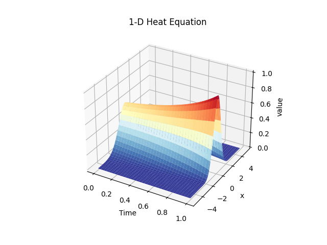
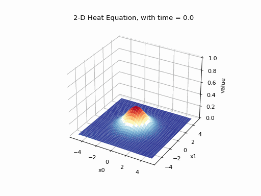

# DGM_Heat_Equation

Apply Deep Galerkin Method (DGM) to solving multi-dimensional heat equation. Visualise 1-d and 2-d heat equations. 

For example:
```
python3 heat_equation_solver.py --d 1
```
<p align="center">

</p>


```
python3 heat_equation_solver.py --d 2
```
<p align="center">

</p>
